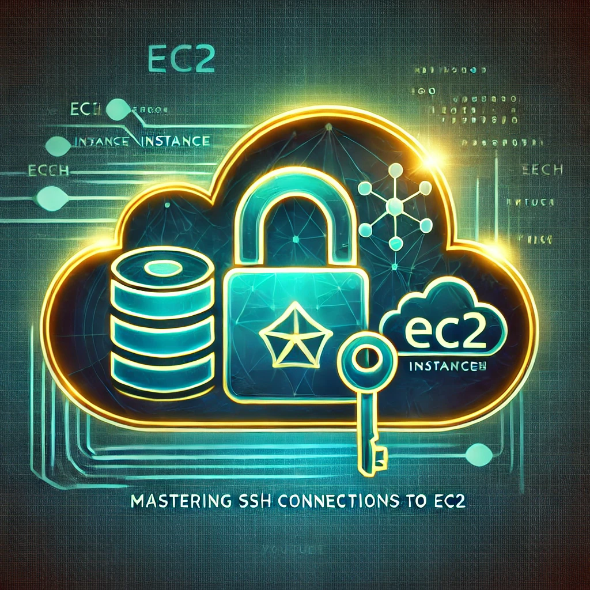
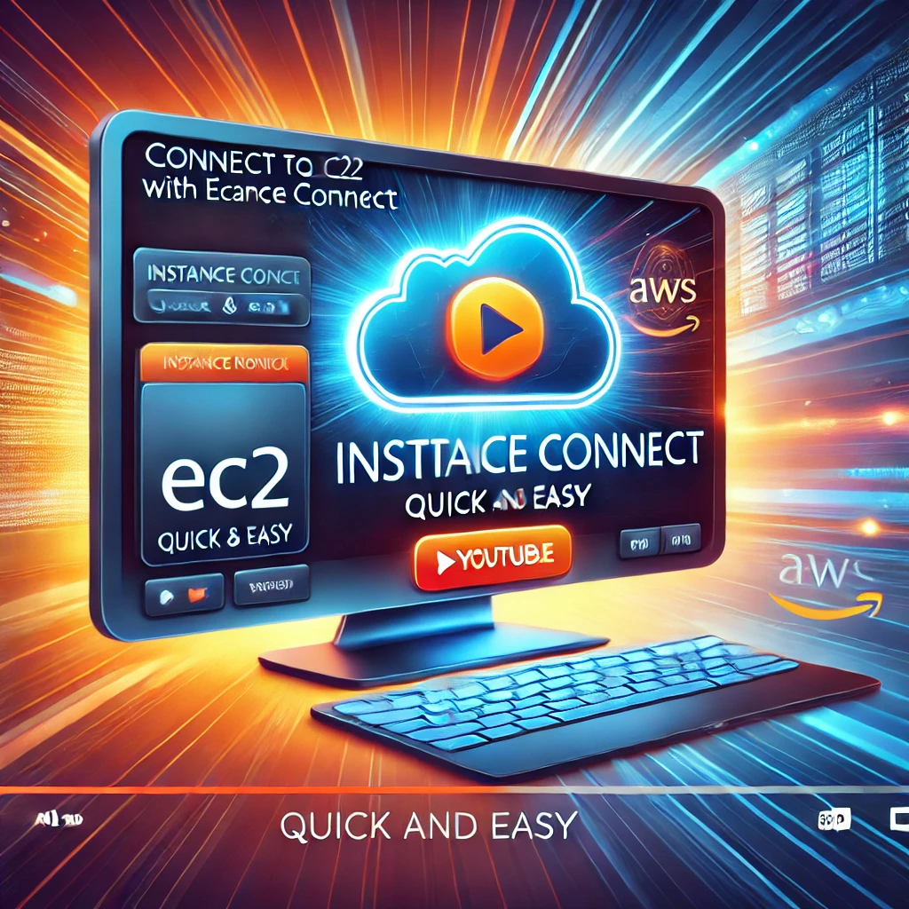
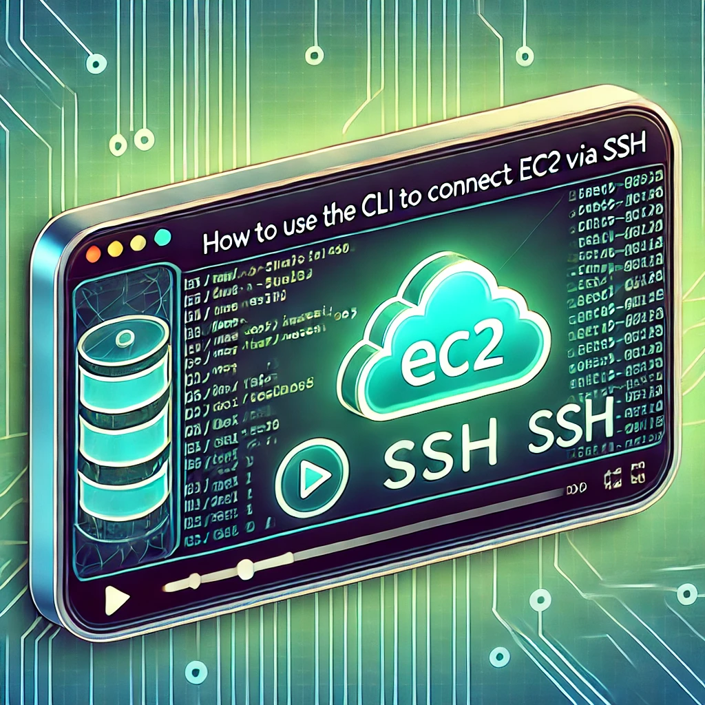
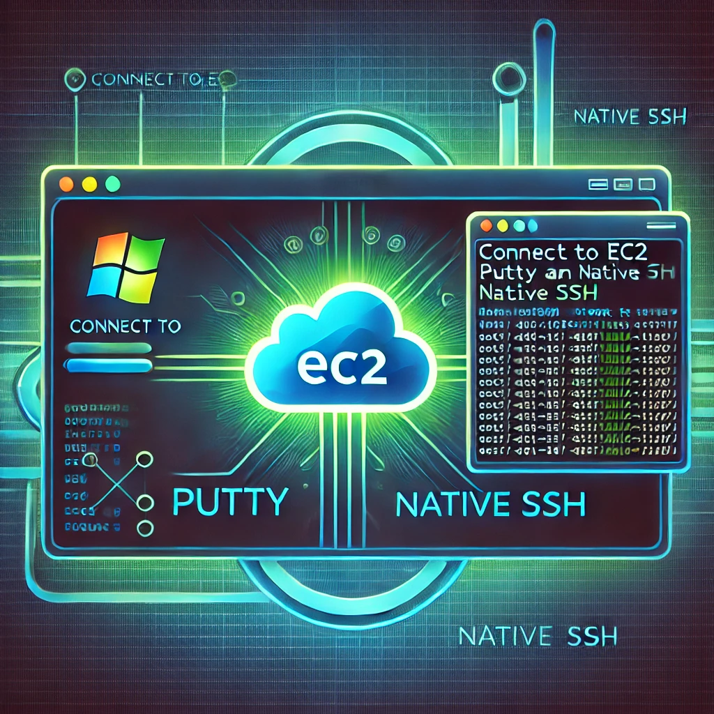

# 🔐 Domina las Conexiones SSH a EC2: De Novato a Experto

## 📝 Descripción de la Serie

¿Quieres aprender a conectarte a tus instancias EC2 de manera segura y eficiente? 🌍🚀

En esta serie de videos, descubrirás todos los métodos esenciales para **dominar las conexiones SSH** a instancias EC2 en AWS, desde los más básicos hasta los más avanzados. Tanto si eres principiante como si ya tienes experiencia, encontrarás consejos prácticos, buenas prácticas y soluciones a problemas comunes. 🛠️

📅 **Un nuevo video cada semana** para que vayas mejorando tus habilidades paso a paso.

---

## 🎯 Objetivo de Aprendizaje

Con esta serie, aprenderás a conectarte a tus instancias EC2 de múltiples maneras, optimizar tu flujo de trabajo y asegurar tus conexiones SSH con las mejores prácticas. Desde comandos básicos hasta configuraciones avanzadas, al finalizar esta serie serás un experto en la gestión de conexiones a EC2. 🔥

---

## 📌 Contenido de la Serie

### 📌 1. Introducción General a EC2 y SSH
- 📍 ¿Qué es EC2 y por qué necesitas SSH?
- 📍 Métodos disponibles para conectarte a una instancia EC2.

**[Video](https://youtu.be/Uqdb9p36yUA)**

### 🔑 2. Conexión mediante Instance Connect desde la Consola AWS
- 📍 Cómo conectarte directamente desde la consola de AWS sin necesidad de claves privadas ni herramientas externas.

**[Video](https://youtu.be/cJSf-yH4gzI)**

### 💻 3. Conexión desde la AWS CLI
- 📍 Uso de **AWS CLI** para gestionar instancias y conectarse de forma automatizada y eficiente.

**[Video](https://youtu.be/KC4-1y23Kes)**

### 🐧 4. Conexión desde Mac/Linux
- 📍 Cómo utilizar el **terminal nativo** de Mac y Linux para conectarte a EC2 de manera sencilla y práctica.

**[Video](https://youtu.be/xuFcYQM3o9I)**

### 🖥️ 5. Conexión desde Windows (Putty y SSH Nativo)
- 📍 Configuración de **Putty** y el **cliente SSH nativo de Windows** para establecer conexiones seguras.

**[Video](https://youtu.be/mpJgbS9vbJA)**

### 🔒 6. Buenas Prácticas y Seguridad al Conectar por SSH
- 📍 Configuración segura de SSH.
- 📍 Uso de **bastion hosts**, **VPNs** y rotación de claves.

**[Video_Parte1](https://youtu.be/wD-QL2kuC_c)**

**[Video_Parte2](https://youtu.be/kR9FkE2fyZA)**

### 🛠️ 7. Resolución de Problemas Comunes
- 📍 Solución a errores típicos como permisos denegados, configuraciones incorrectas en **Security Groups**, errores de **timeout**, etc.

**[Video_Parte1](https://youtu.be/KTZF5sk8z_s)**

**[Video_Parte2](https://youtu.be/x3Hx-rpl30w)**

---

## ✅ ¿Por qué deberías ver esta serie?

🔹 Aprende desde lo más básico hasta técnicas avanzadas.  
🔹 Mejora tu seguridad al conectarte a servidores en AWS.  
🔹 Ahorra tiempo con conexiones optimizadas.  
🔹 **¡Convierte tus habilidades SSH en un superpoder en la nube!** 💪⚡

Suscríbete ahora a **'CloudOps Guild'** y transforma tu manera de trabajar con AWS. 🎥🔥

---

## 📚 Recursos Adicionales

- 📖 [Documentación oficial de AWS EC2 y SSH](https://docs.aws.amazon.com/AWSEC2/latest/UserGuide/AccessingInstances.html)
- 🎥 [Playlist completa en YouTube](URL)
- 🔐 [Guía sobre seguridad en conexiones SSH](https://docs.aws.amazon.com/AWSEC2/latest/UserGuide/ec2-key-pairs.html)
- 📝 [Checklist de buenas prácticas](recursos/checklist_buenas_practicas_SSH.pdf)
- 🛠️ [Listado errores comunes](recursos/errores_comunes_SSH.pdf)

---

## 🤝 ¡Conéctate conmigo!
🌟 **YouTube:** [CloudOps Guild](https://www.youtube.com/@CloudOpsGuildCommunity)  
✍️ **Medium:** [@marioserranopineda](https://medium.com/@marioserranopineda)  
💼 **LinkedIn:** [Mario Serrano](https://www.linkedin.com/in/mario-rodrigo-serrano-pineda/)  

## 📢 ¡Síguenos en nuestras redes!
📝 **Blog CloudOpsGuild:** [Blog](https://cloudopsguild.com/blog/)  
💼 **LinkedIn CloudOpsGuild:** [CloudOps Guild](https://www.linkedin.com/company/cloudopsguild/)  
📅 **MeetUp:** [Grupo MeetUp AWS Cartagena Community](https://www.meetup.com/es-ES/aws-colombia-cartagena/)  
📘 **Facebook:** [AWS Cartagena Community](https://www.facebook.com/aws.cartagena/)  

---

## 📝 **Licencia**
Este proyecto está bajo la licencia **MIT**. Puedes consultar los detalles en el archivo **LICENSE**. 📜
