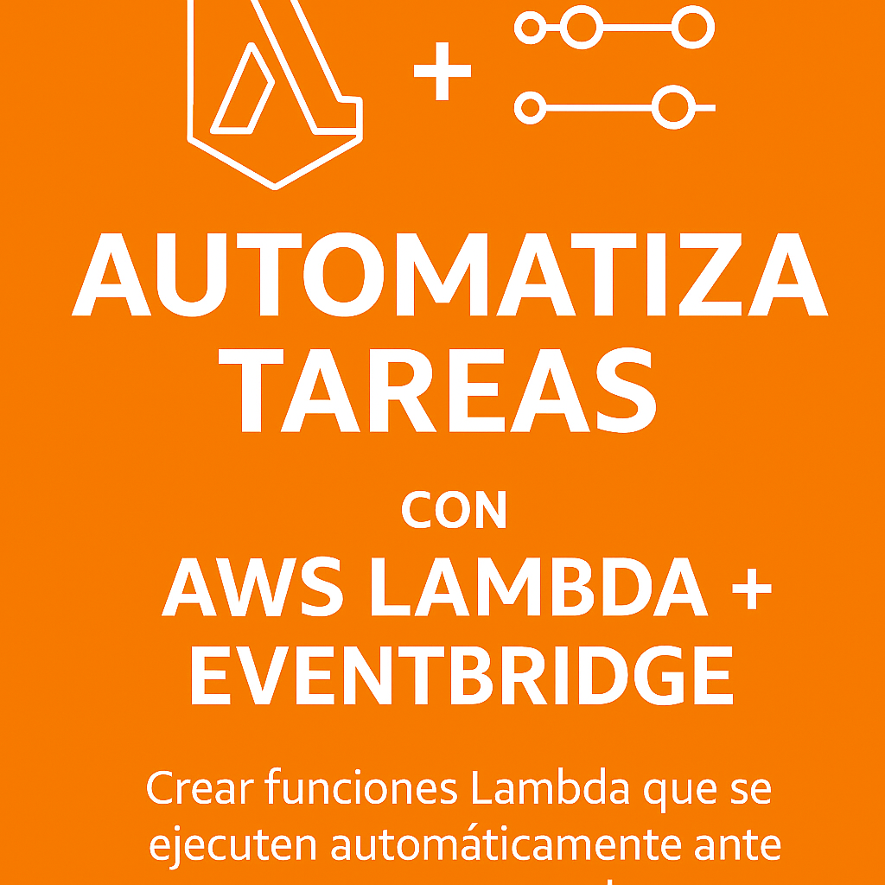
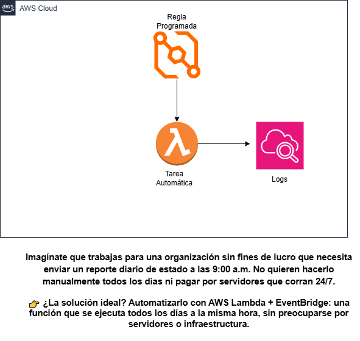

# ⚙️ Lab Cloud: Automatiza Tareas con AWS Lambda \+ EventBridge



🎯*Objetivo:* Crear funciones Lambda que se ejecuten automáticamente ante eventos programados (por ejemplo: todos los días a cierta hora).

🧠*Nivel:* Intermedio (ideal para personas que están aprendiendo a automatizar tareas en la nube)

⏱️*Duración estimada:* 45–60 minutos    
💰*Costo:* Bajo (entra en el nivel gratuito si usas Lambda y EventBridge con uso básico)

---

## 📘 Tabla de contenidos

- 🧪 Escenario del mundo real 
- 🗂️ Diagrama de arquitectura del laboratorio   
- 🤔 ¿Qué es AWS Lambda \+ EventBridge?    
- ✨ Características principales    
- 🛠️ Paso a paso: Automatiza tareas con Lambda \+ EventBridge    
  - Paso 1: Requisitos previos    
  - Paso 2: Crear la función Lambda    
  - Paso 3: Crear una regla de programación con EventBridge    
  - Paso 4: Probar que la tarea se ejecuta automáticamente    
- 🚩 Retos comunes y cómo resolverlos    
- 🧠 Expresiones cron útiles    
- 🔑 Conclusiones y próximos pasos    
- 🚀 ¿Qué sigue?
- 📚 Recursos del laboratorio

---

## 🧪 Escenario del mundo real

Imagina que trabajas para una organización sin fines de lucro que necesita enviar un reporte diario a las 9:00 a.m. No quieren hacerlo manualmente todos los días ni pagar por servidores activos 24/7.

👉 ¿La solución ideal? Automatizarlo con *AWS Lambda + Amazon EventBridge*.

---

### 🗂️ Diagrama de arquitectura del laboratorio
- 📍 Creación paso a paso del diagrama y explicación en video abajo en Recursos.



---

## 🤔 ¿Qué es AWS Lambda + EventBridge?

- **AWS Lambda** permite ejecutar código sin tener que administrar servidores.  
- **Amazon EventBridge** permite programar eventos usando expresiones cron.

🔁 Juntos, permiten ejecutar tareas programadas automáticamente, sin preocuparte por la infraestructura.

---

## ✨ Características principales

✅ Sin servidores que mantener    
✅ Escalado automático    
✅ Bajo costo: pagas solo por ejecución    
✅ Integración sencilla con otros servicios de AWS    
✅ Ideal para tareas recurrentes (reportes, limpieza, alertas)

---

## 🛠️ Paso a paso: Automatiza tareas con Lambda \+ EventBridge

### 🔹 Paso 1: Requisitos previos

- ✅ Cuenta activa en AWS    
- ✅ Permisos para usar Lambda, EventBridge e IAM    
- ✅ Acceso a la consola de AWS    
- ✅ Conocimientos básicos de Python  

---

### 🔹 Paso 2: Crear la función Lambda

1. Ve al servicio **Lambda**    
2. Haz clic en **Crear función**    
3. Configura:  
   - ⚙️ Autor desde cero    
   - ✍️ Nombre: \`tareaAutomaticaDiaria\`    
   - 🐍 Runtime: Python 3.13    
4. Haz clic en \*\*Crear función\*\*    
5. Reemplaza el código por el siguiente:

```python  
import json  
from datetime import datetime

def lambda\_handler(event, context):  
    ahora \= datetime.now().strftime("%Y-%m-%d %H:%M:%S")  
    mensaje \= f"Tarea automática ejecutada exitosamente a las {ahora}."

    print(mensaje)

    return {  
        'statusCode': 200,  
        'body': json.dumps({'mensaje': mensaje}, ensure\_ascii=False)  
    }
```

6. Haz clic en **Deploy** para guardar los cambios.

---

### **🔹 Paso 3: Crear una regla de programación con EventBridge**

1. Ve a **Amazon EventBridge**

2. Clic en **Reglas \> Crear regla**

3. Nombre: `tareaDiaria9am`

4. En patrón, selecciona: `Programado (cron)`

5. Usa esta expresión cron:

cron(0 9 * * ? *)

⏰ Esta expresión ejecuta la función todos los días a las 9:00 a.m. (UTC).  
 ⚠️ Recuerda ajustar a tu zona horaria local.

6. Valida la configuración y haz clic en **Siguiente**

7. En destino, elige: **AWS Lambda Invoke**

8. Selecciona tu función `tareaAutomaticaDiaria`

9. Acepta los permisos sugeridos

10. Haz clic en **Crear regla**

---

### **🔹 Paso 4: Probar que la tarea se ejecuta automáticamente**

1. Espera al horario configurado (o usa una expresión de prueba más cercana)

2. Ve a **CloudWatch Logs**

3. Busca tu función `tareaAutomaticaDiaria`

4. Revisa los registros más recientes

✅ Deberías ver una salida como esta:

Tarea automática ejecutada exitosamente a las 2025-04-04 09:00:00.

🎉 ¡Automatización completada exitosamente\!

---

## **🚩 Retos comunes y cómo resolverlos**

| Problema | Solución |
| ----- | ----- |
| La función no se ejecuta | Verifica que la regla esté **habilitada** |
| No aparecen logs | Revisa que Lambda tenga permisos para escribir en **CloudWatch Logs** |
| Hora incorrecta | Asegúrate de usar **formato UTC** en la expresión cron |
| Error de permisos | Verifica que **EventBridge tenga permiso para invocar la función Lambda** |

---

## **🧠 Expresiones cron útiles**

| Frecuencia | Expresión cron |
| ----- | ----- |
| Cada 1 minuto | `cron(0/1 * * * ? *)` |
| Cada 5 minutos | `cron(0/5 * * * ? *)` |
| Cada 15 minutos | `cron(0/15 * * * ? *)` |
| Cada hora | `cron(0 * * * ? *)` |
| Todos los días a las 9:00 AM | `cron(0 9 * * ? *)` |
| Todos los lunes a las 8:30 AM | `cron(30 8 ? * 2 *)` |
| Día 1 de cada mes a las 00:00 | `cron(0 0 1 * ? *)` |
| Cada domingo a las 6:00 PM | `cron(0 18 ? * 1 *)` |

🕒 Amazon EventBridge usa el formato cron de 6 campos y **basado en UTC**.

---

## **🔑 Conclusiones y próximos pasos**

✔ Automatizaste una tarea sin usar servidores  
✔ Usaste Lambda \+ EventBridge como una solución elegante y escalable  
✔ Reforzaste tus habilidades con programación de tareas en la nube

---

## **🚀 ¿Qué sigue?**

* Programar reportes semanales o mensuales

* Enviar notificaciones automáticas por correo o SMS

* Automatizar limpieza de buckets o bases de datos

* Conectar Lambda con SNS, SES o Slack

* Subir este proyecto a GitHub y compartirlo con la comunidad

## 📚 Recursos del laboratorio

**1. Código Lambda**  
**2. Video tutorial paso a paso [aquí](https://youtu.be/b1Sz22Umc8Q)**
**3. Expresiones cron útiles**

---

📣 ¿Te gustó este laboratorio?  
 Comparte tu resultado usando **\#LabCloudAWS** y etiqueta a la comunidad 🚀

