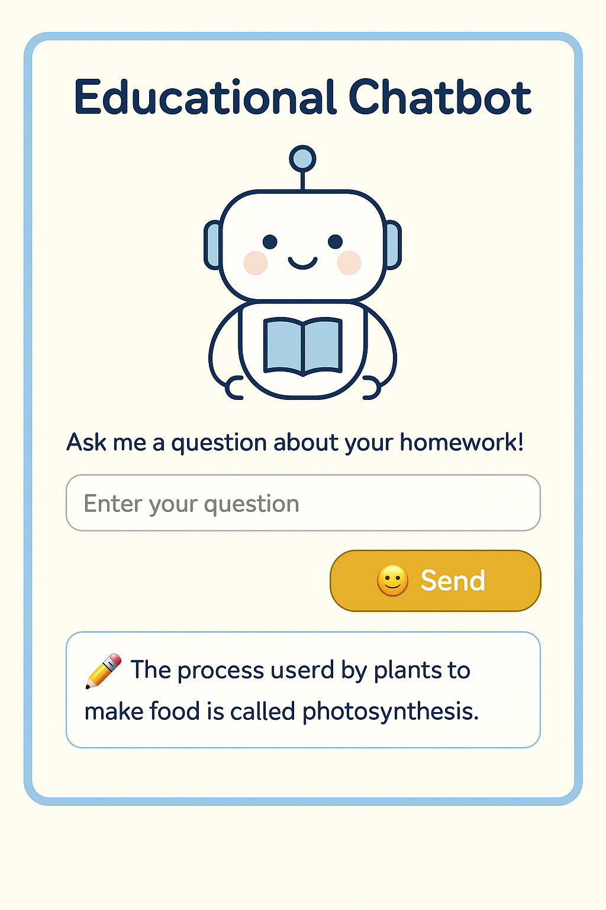
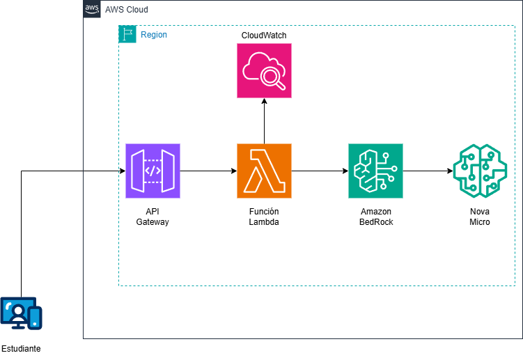

# 🤖 Lab Cloud – Crea un Chatbot Educativo con Amazon Bedrock + Nova Micro



En este laboratorio práctico construirás un chatbot educativo utilizando **Amazon Bedrock**, el modelo **Nova Micro**, **AWS Lambda** y **API Gateway**, todo con arquitectura 100% serverless. El asistente responderá preguntas escolares en español, y podrás conectarlo fácilmente a un sitio web.

---

## 🎯 Objetivo

Desplegar un chatbot sin servidores que responda a consultas escolares, usando agentes de Amazon Bedrock y exponerlo mediante una API pública accesible desde navegador.

🧠 **Nivel:** Intermedio  
⏱️ **Duración estimada:** 90 minutos  
💰 **Costo:** Bajo (menos de $1 por miles de consultas fuera del Free Tier)

---

## 🧩 Caso de uso

Una familia o institución quiere ofrecer a los niños una forma segura y simple de consultar conceptos escolares como "¿Qué es la fotosíntesis?" sin usar buscadores abiertos. Con Amazon Bedrock y Nova Micro crearemos un asistente conversacional amigable, personalizado y accesible.

---

## 🛠 Servicios utilizados

- ⚙️ **Amazon Bedrock** – para crear y administrar el agente
- 🧠 **Modelo Nova Micro** – rápido, eficiente y en español
- 🐍 **AWS Lambda (Python 3.13)** – para recibir preguntas y conectar con el agente
- 🌐 **API Gateway (HTTP API)** – para exponer la API al mundo
- 🖥️ **Servidor local o Amazon S3** – para probar o publicar el frontend educativo

---

## 🗂️ Diagrama de arquitectura



---

## 🚀 ¿Qué aprenderás?

- Cómo crear y preparar un agente en Amazon Bedrock
- Cómo invocar un agente desde Lambda usando `invoke_agent`
- Cómo exponerlo con API Gateway (HTTP API)
- Cómo configurar correctamente CORS
- Cómo probarlo con `curl` y desde navegador local

---

## 🧱 Paso a paso completo

### 1️⃣ Crear agente en Amazon Bedrock

1. Ir a **Amazon Bedrock > Model Access** y solicitar acceso al modelo **Amazon Titan - Nova Micro** si aún no lo tienes.
2. Ir a **Amazon Bedrock > Agents** y hacer clic en **Create Agent**.
3. Completar:
   - **Name**: `ChatbotEscolarNova`
   - **Model**: `Amazon Titan - Nova Micro`
   - **Prompt**:  
     `"Actúa como un asistente de tareas escolares. Responde en español de forma clara, segura y adaptada a un niño de primaria."`
   - **Agent resource role**: seleccionar `Create and use a new role`
   - ✅ **Habilitar User Input**
4. Clic en **Create Agent**. El agente quedará en estado `NOT_PREPARED`.
5. Hacer clic en **Prepare** para dejarlo en estado `PREPARED`.
6. Ir a la pestaña **Aliases** > **Create alias**:
   - Alias name: `DRAFT` (nombre lógico)
   - Se generará un **Alias ID alfanumérico**, que se debe copiar.
7. Copiar:
   - `Agent ID`
   - `Alias ID` (el código, **no solo la palabra "DRAFT"**)
8. Probar el agente desde la consola usando el botón **Test Agent**.

---

### 2️⃣ Crear función Lambda

1. Ir a **AWS Lambda > Create function**
2. Tipo: **Author from scratch**
3. Nombre: `InvokeNovaMicroAgent`
4. Runtime: `Python 3.13`
5. Rol: `Create a new role with basic Lambda permissions`
6. Una vez creada la función:
   - Ir a IAM > Roles > Buscar el rol creado automáticamente
   - Editar y **añadir permisos `bedrock:InvokeAgent`**
7. Ir a Lambda > **Configuration > Environment variables**
   - `AGENT_ID = tu_id_de_agente`
   - `AGENT_ALIAS_ID = tu_alias_id_alfanumérico`
8. Reemplazar el contenido por el siguiente código:

```python
import boto3
import os
import json

session = boto3.session.Session(region_name='us-east-1')
bedrock_runtime = session.client("bedrock-agent-runtime")

def lambda_handler(event, context):
    method = event["requestContext"]["http"]["method"]

    if method == "OPTIONS":
        return {
            "statusCode": 200,
            "headers": {
                "Access-Control-Allow-Origin": "*",
                "Access-Control-Allow-Headers": "Content-Type",
                "Access-Control-Allow-Methods": "POST, OPTIONS"
            },
            "body": ""
        }

    try:
        body = json.loads(event['body'])
        user_input = body.get('input', '')

        if not user_input:
            return {
                "statusCode": 400,
                "body": json.dumps({"error": "No input provided"})
            }

        # Debug opcional
        print("AGENT_ID:", os.environ.get('AGENT_ID'))
        print("AGENT_ALIAS_ID:", os.environ.get('AGENT_ALIAS_ID'))

        response_stream = bedrock_runtime.invoke_agent(
            agentId=os.environ['AGENT_ID'],
            agentAliasId=os.environ['AGENT_ALIAS_ID'],
            sessionId="chatbot-session",
            inputText=user_input
        )

        result_text = ""
        for event in response_stream['completion']:
            if "chunk" in event:
                result_text += event["chunk"]["bytes"].decode("utf-8")

        return {
            "statusCode": 200,
            "headers": {
                "Content-Type": "application/json",
                "Access-Control-Allow-Origin": "*"
            },
            "body": json.dumps({"response": result_text})
        }

    except Exception as e:
        return {
            "statusCode": 500,
            "body": json.dumps({"error": str(e)})
        }
```
---

3️⃣ Crear HTTP API en API Gateway

1. Ir a API Gateway > HTTP APIs > Create API > Build
2. Desactivar la opción Auto Deploy
3. Crear nueva integración:
  - Tipo: Lambda
  - Función: InvokeNovaMicroAgent
4. Crear rutas:
  - Método: POST – Path: /chatbot
  - (Opcional) Método: OPTIONS para /chatbot
5. Crear un stage manual llamado $default
6. Ir a la sección Deployments > Deploy stage
7. Activar CORS:
  - Origins: *
  - Methods: POST
  - Headers: Content-Type
8. Hacer clic en Deploy para aplicar configuración CORS

**Recordar siempre que hagas cambios en el API hacer Deploy en el stage que estas trabajando.**

---

## 🧪 Prueba rápida con curl

```bash
curl -X POST https://<api-id>.execute-api.us-east-1.amazonaws.com/chatbot \
  -H "Content-Type: application/json" \
  -d '{"input": "¿Qué es la fotosíntesis?"}'
```

Respuesta esperada:

```
{
  "response": "La fotosíntesis es un proceso mediante el cual las plantas convierten la luz solar en energía..."
}
```
---

## 💡 Detalles importantes
✅ Usa el Alias ID alfanumérico, no el nombre "DRAFT"

✅ El agente debe estar en estado Prepared

✅ El parámetro User Input debe estar habilitado para evitar errores de acceso

✅ Las variables de entorno en Lambda deben contener AGENT_ID y AGENT_ALIAS_ID

---

## 🌐 Prueba en navegador

Ejecuta:

```bash
   python3 -m http.server
```

Abre en navegador:
```
http://localhost:8000/index.html
```

📦 El HTML ya está preparado con diseño infantil y listo para producción. Solo cambia tu URL de API en el script.

---

## 🖼️ Recursos

📄 [Guía paso a paso del laboratorio](https://youtu.be/lZyouFmQClw)

🧠 Imagen de arquitectura

🧑‍🏫 Frontend HTML educativo [aquí](./recursos/index.html)

🔁 Código completo de Lambda (Python)

---

## 📢 Conecta con la comunidad

- **YouTube:** [CloudOps Guild](https://www.youtube.com/@CloudOpsGuildCommunity)  
- **Medium:** [@marioserranopineda](https://medium.com/@marioserranopineda)  
- **LinkedIn (autor):** [Mario Serrano](https://www.linkedin.com/in/mario-rodrigo-serrano-pineda/)  
- **Blog:** [CloudOps Guild](https://cloudopsguild.com/blog/)  
- **MeetUp:** [AWS Cartagena Community](https://www.meetup.com/es-ES/aws-colombia-cartagena/)  
- **Facebook:** [AWS Cartagena](https://www.facebook.com/awscolombiacartagena)

🎉 **¡Felicidades! Has creado tu primer chatbot educativo sin servidores usando Amazon Bedrock y Modelos Amazon Nova.**

---

## 📝 Licencia

Este proyecto está bajo la licencia MIT. Consulta el archivo LICENSE para más detalles.


