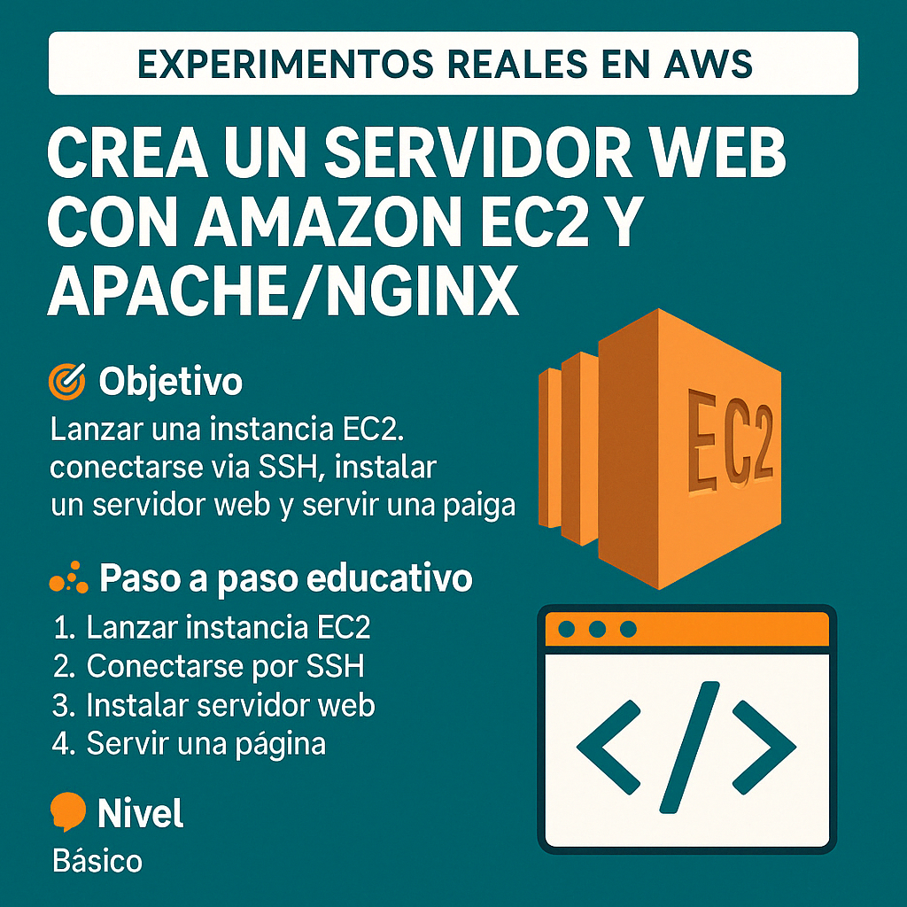

# 🧪 Lab Cloud: Crea un Servidor Web con Amazon EC2 y Apache/Nginx



🎯 **Objetivo:**  
Aprender a lanzar una instancia EC2, conectarse mediante SSH, instalar un servidor web y servir una página HTML desde la nube.

🧠 **Nivel:** Básico  
⏱️ **Duración estimada:** 40–60 minutos  
💰 **Costo estimado:** Bajo (usa el nivel gratuito con `t2.micro` o `t3.micro`)

---

## 🧩 Caso de uso real

**GreenBite**, una comunidad de recetas saludables, quiere lanzar su primer sitio web de forma rápida y sin pagar por hosting compartido. Para validar sus conocimientos en la nube, el equipo decide desplegar una página HTML simple utilizando Amazon EC2 y un servidor web como Apache o Nginx.

---

## 🛠️ Requisitos

- Cuenta en AWS activa
- Archivo `.pem` del par de claves descargado
- Terminal (Mac/Linux) o PuTTY + WinSCP (Windows)
- Conexión a internet

---

## 👣 Paso a paso

### 🔹 1️⃣ Lanzar la instancia EC2

1. Inicia sesión en [https://console.aws.amazon.com](https://console.aws.amazon.com)
2. Navega a **EC2 > Instancias > Lanzar instancia**
3. Configura:
   - **Nombre:** `ServidorWeb-GreenBite`
   - **AMI:** Amazon Linux 2023
   - **Tipo:** `t2.micro` o `t3.micro` (nivel gratuito)
   - **Par de claves:** selecciona o crea uno (.pem)
   - **Grupo de seguridad:**
     - Puerto **22 (SSH)** desde tu IP o (0.0.0.0/0) no recomendado
     - Puerto **80 (HTTP)** desde `0.0.0.0/0`
4. Haz clic en **Lanzar instancia**

---

### 🔹 2️⃣ Conectarse por SSH

#### 🅰️ Desde Mac/Linux

```bash
chmod 400 ServidorWeb-GreenBite.pem
ssh -i ServidorWeb-GreenBite.pem ec2-user@<IP_PUBLICA>
```

> Si el archivo `.pem` está en otra ruta, usa la ruta completa:  
> `ssh -i /ruta/a/ServidorWeb-GreenBite.pem ec2-user@<IP_PUBLICA>`

#### 🅱️ Desde Windows

1. Usa **PuTTYgen** para convertir `.pem` a `.ppk`
2. Abre **PuTTY** y configura:
   - Host Name: `ec2-user@<IP_PUBLICA>`
   - SSH > Auth > selecciona el archivo `.ppk`
3. Conéctate

---

### 🔹 3️⃣ Instalar el servidor web

#### Apache

```bash
sudo yum update -y                         # Actualiza paquetes
sudo yum install httpd -y                 # Instala Apache
sudo systemctl start httpd                # Inicia Apache
sudo systemctl enable httpd               # Activa Apache al arranque
```

📂 Ruta para Apache: `/var/www/html`

#### Nginx (opcional)

```bash
sudo amazon-linux-extras enable nginx1    # Habilita repositorio Nginx
sudo yum install nginx -y                 # Instala Nginx
sudo systemctl start nginx                # Inicia Nginx
sudo systemctl enable nginx               # Activa Nginx al arranque
```

📂 Ruta para Nginx: `/usr/share/nginx/html`

---

### 🔹 4️⃣ Crear o subir tu página HTML

#### 🅰️ Crear archivo directamente desde la terminal

##### Apache:

```bash
echo "<html><h1>Bienvenido a GreenBite</h1><p>Comunidad de recetas saludables.</p></html>" | sudo tee /var/www/html/index.html
```

##### Nginx:

```bash
echo "<html><h1>Bienvenido a GreenBite</h1><p>Comunidad de recetas saludables.</p></html>" | sudo tee /usr/share/nginx/html/index.html
```

#### 🅱️ Subir archivo HTML desde tu equipo

##### Desde Mac/Linux:

```bash
scp -i ServidorWeb-GreenBite.pem index.html ec2-user@<IP_PUBLICA>:/tmp/
ssh -i ServidorWeb-GreenBite.pem ec2-user@<IP_PUBLICA>
sudo mv /tmp/index.html /var/www/html/          # O /usr/share/nginx/html/
```

##### Desde Windows (WinSCP + PuTTY):

1. Abre **WinSCP** y conecta con `ec2-user@<IP_PUBLICA>` usando tu `.ppk`
2. Sube `index.html` a `/tmp/`
3. Conéctate con **PuTTY** y ejecuta:

```bash
sudo mv /tmp/index.html /var/www/html/          # O /usr/share/nginx/html/
```

---

### 🔹 5️⃣ Verificar el sitio en el navegador

Abre tu navegador web y accede a:  
```
http://<IP_PUBLICA>
```

✅ Deberías ver tu sitio web con el contenido de `index.html`.

---

### 🔹 6️⃣ Reiniciar Apache (si hiciste cambios)

```bash
sudo systemctl restart httpd
```

---

### 🔹 7️⃣ Detener o terminar la instancia (evitar cargos)

1. Ve a **EC2 > Instancias**
2. Selecciona la instancia
3. Haz clic en **Detener** o **Terminar**

---

## 📚 Recursos del laboratorio

**1. Scripts para apache y Ngnix de instalación servidor web**  
**2. Código HTML del frontend demo**  
**3. Video tutorial paso a paso** [Aquí](https://youtu.be/Ys72Gu2i7d8)
**4. Comandos para copiar archivos desde maquina local a instancia linux en AWS**

---

## 📢 ¿Te gustó este laboratorio?

Forma parte de nuestra comunidad **CloudOps Guild** y sigue aprendiendo con laboratorios reales en AWS, DevOps y automatización:

## 📢 Conecta con la comunidad

- **YouTube:** [CloudOps Guild](https://www.youtube.com/@CloudOpsGuildCommunity)  
- **Medium:** [@marioserranopineda](https://medium.com/@marioserranopineda)  
- **LinkedIn (autor):** [Mario Serrano](https://www.linkedin.com/in/mario-rodrigo-serrano-pineda/)  
- **Blog:** [CloudOps Guild](https://cloudopsguild.com/blog/)  
- **MeetUp:** [AWS Cartagena Community](https://www.meetup.com/es-ES/aws-colombia-cartagena/)  
- **Facebook:** [AWS Cartagena](https://www.facebook.com/awscolombiacartagena)

---

¡Nos vemos en el próximo laboratorio de la serie  
**Lab Cloud: Experimentos Reales con AWS**! 🚀
```

## 📝 Licencia

Este proyecto está bajo la licencia MIT. Consulta el archivo [LICENSE](LICENSE) para más detalles.

---