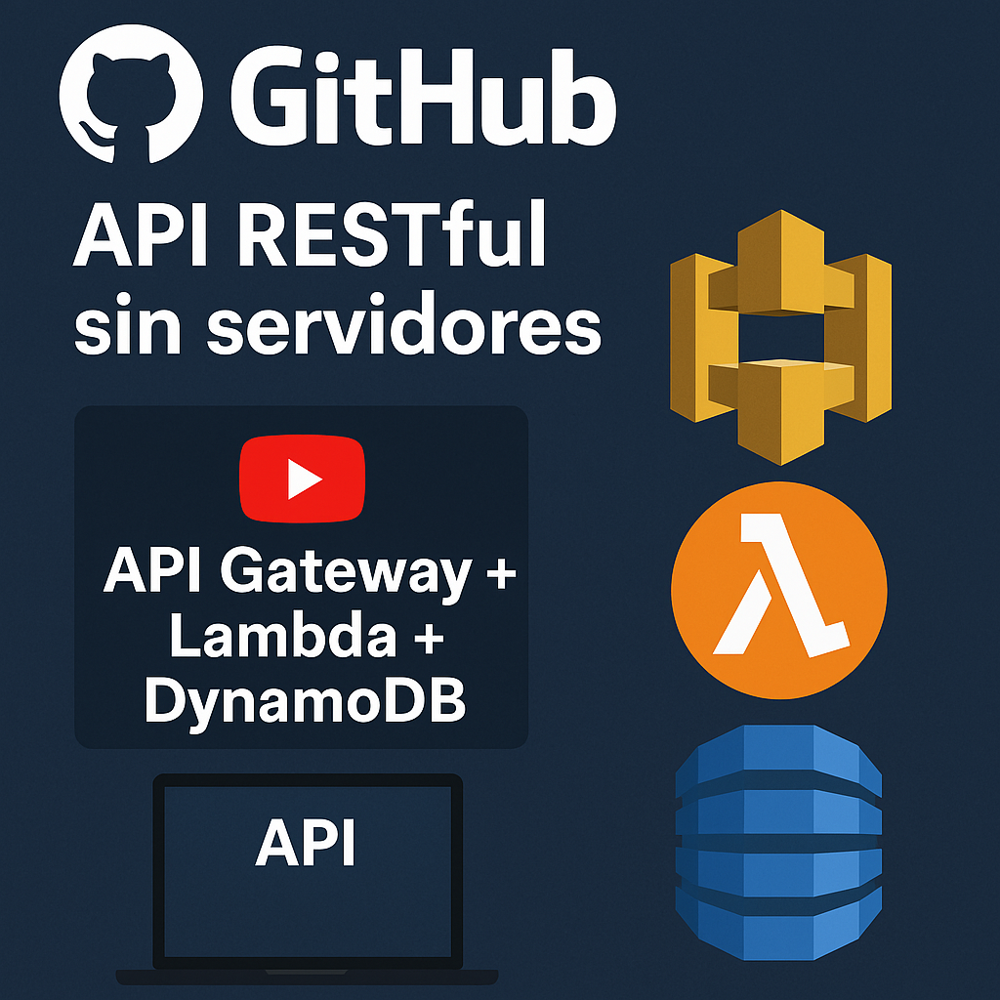
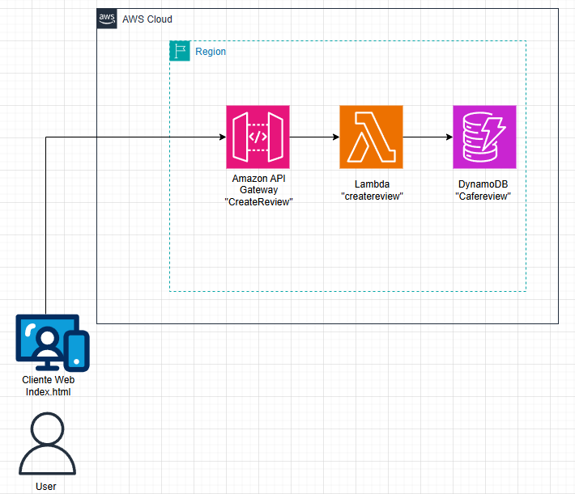

# 🌐 Lab Cloud – Crea una API RESTful sin Servidores con AWS API Gateway + Lambda

En esta serie de tres partes, construirás paso a paso una API RESTful sin servidores, conectada a una base de datos DynamoDB, y con una interfaz web en HTML para consumirla. ¡Todo en AWS y sin manejar servidores!

---

🧪 Escenario real: CloudFizz es una startup que quiere lanzar una app de reseñas de cafeterías locales. Necesitan una API para que los usuarios puedan crear reseñas, pero no quieren manejar servidores, ni infraestructura.
 La solución ideal: una API serverless con AWS API Gateway + AWS Lambda.

 ---

### 🗂️ Diagrama de arquitectura del laboratorio
- 📍 Creación paso a paso del diagrama y explicación en video abajo en Recursos.

## 📚 **Conceptos básicos**

🤔 **¿Qué es una API RESTful serverless?**
Una API RESTful sin servidores permite manejar peticiones HTTP (como POST, GET, etc.) sin tener que configurar ni mantener servidores. Usamos:

API Gateway: Recibe y enruta las peticiones HTTP

Lambda: Ejecuta el código que responde a esas peticiones

Esto significa escalabilidad automática, bajo costo y simplicidad.

Un **API RESTful** (o simplemente API REST) es una forma de construir servicios web que permite la comunicación entre sistemas a través del protocolo HTTP, usando principios del estilo de arquitectura REST (Representational State Transfer).
En palabras simples:
Una **API RESTful** te permite que dos aplicaciones (por ejemplo, un sitio web y un servidor) se comuniquen entre sí de manera organizada y sencilla, usando URLs y los métodos estándar de HTTP como:

Un **API Gateway** es un servicio que actúa como puerta de entrada entre los clientes (como apps web, móviles, etc.) y los servicios backend (como funciones Lambda, microservicios, bases de datos, etc.).

En otras palabras:
Es como un portero inteligente que recibe todas las solicitudes externas a tu aplicación y decide:
A dónde enviarlas

Cómo procesarlas

Si están permitidas

Si deben ser transformadas o autenticadas

**¿Qué puede hacer un API Gateway?**
 ✅ Redirige peticiones al backend correcto
 ✅ Aplica autenticación/autorización (por ejemplo, con tokens JWT)
 ✅ Limita el número de peticiones por usuario (rate limiting)
 ✅ Agrega caché para respuestas comunes
 ✅ Convierte protocolos (por ejemplo, de REST a WebSocket o gRPC)
 ✅ Maneja errores y respuestas uniformes

✨ **Características principales**
 ✅ No necesitas administrar servidores
 ✅ Escala automáticamente
 ✅ Bajo costo: solo pagas por uso
 ✅ Integración nativa con otros servicios de AWS
 ✅ Ideal para prototipos, microservicios y aplicaciones reales

**cURL** es una herramienta de línea de comandos que permite transferir datos entre un servidor y un cliente. Es de código abierto y está disponible en la mayoría de los sistemas operativos.

**GET:** Obtener datos (por ejemplo, una lista de productos)

**POST:** Crear nuevos datos (por ejemplo, registrar un usuario)

**PUT:** Actualizar datos existentes (por ejemplo, editar un perfil)

**DELETE:** Eliminar datos (por ejemplo, borrar una cuenta)

**¿Por qué se usa tanto?**

Es ligero y fácil de entender.

Funciona sobre HTTP, el mismo protocolo que usa la web.

Es escalable y puede ser consumido por muchas aplicaciones diferentes (web, móviles, etc.).

## 🎯 Objetivo de Aprendizaje

Al finalizar este laboratorio, serás capaz de diseñar, desplegar y probar una API funcional utilizando **AWS Lambda**, **API Gateway**, **DynamoDB** y un **frontend en HTML puro**, todo con arquitectura serverless.

---

## 🛠️ Servicios usados en este laboratorio

- 🔹 **AWS Lambda**
- 🔹 **Amazon API Gateway**
- 🔹 **Amazon DynamoDB**
- 🔹 **IAM**
- 🔹 **Amazon S3 (para el frontend opcional)**

---

## 🔍 Descripción del laboratorio por partes

---

### 🧪 Parte 1 – Crea tu API RESTful sin servidores

🎯 Diseñamos una API RESTful usando **API Gateway + Lambda**, sin necesidad de gestionar servidores.

#### 🗂️ ¿Qué haremos?

1️⃣ Crear una función Lambda básica en Python  
2️⃣ Crear un endpoint REST con API Gateway  
3️⃣ Configurar Mapping Templates  
4️⃣ Probar la API con `curl` desde terminal  
5️⃣ Resolver errores comunes  

📺 **[Ver video de la Parte 1 →](https://youtu.be/-cbeZ6laFRE)**  
📄 Código y configuración → incluidos en el paso a paso **[aquí →](/recursos/APIRESTful_serverless_Parte1.pdf)** 

➡️ En la **Parte 2** conectaremos esta API con DynamoDB para guardar las reseñas.

---

### 🧪 Parte 2 – Guarda tus Reseñas en DynamoDB

🎯 Ahora que tu API funciona, extenderemos la lógica de negocio para **guardar los datos** enviados desde el frontend en una base de datos NoSQL con **Amazon DynamoDB**.

#### 🗂️ ¿Qué haremos?

1️⃣ Crear una tabla DynamoDB llamada `ResenasCafe`  
2️⃣ Otorgar permisos a Lambda para acceder a DynamoDB  
3️⃣ Reescribir la función Lambda para insertar datos  
4️⃣ Probar el flujo completo con `curl`  
5️⃣ Validar que los datos se almacenan en la tabla  

⚠️ Se incluye control de errores y buenas prácticas para entornos reales.

📺 **[Ver video de la Parte 2 →](https://youtu.be/01WQ5622YaU)** 
📄 Código Lambda actualizado incluido en el recurso del laboratorio **[aquí →](/recursos/APIRESTful_serverless_Parte2.pdf)**

➡️ En la **Parte 3**, crearemos un frontend HTML para enviar reseñas directamente desde el navegador.

---

### 🧪 Parte 3 – Crea un Frontend HTML que use tu API

🎯 Diseñaremos una interfaz web simple para enviar reseñas usando tu API RESTful con `fetch` desde el navegador.

#### 🗂️ ¿Qué haremos?

1️⃣ Crear una página HTML con un formulario para reseñas  
2️⃣ Enviar los datos usando JavaScript (`fetch`)  
3️⃣ Mostrar mensajes de éxito o error  
4️⃣ Probar la integración completa  
5️⃣ Mejorar la experiencia de usuario  

👨‍💻 El formulario incluirá campos de usuario y comentario.  
🧠 Solo debes reemplazar la URL de tu endpoint API en el script.

📺 **[Ver video de la Parte 3 →](https://youtu.be/vTXzrKhdhiA)** 
📄 Código completo del `index.html` incluido **[aquí →](/recursos/APIRESTful_serverless_Parte3.pdf)**

---

## ⚠️ Consideraciones Importantes

- Asegúrate de configurar correctamente el **Mapping Template** para que los datos lleguen bien a Lambda (Opcional, solo si necesitas transformar estructura de los datos enviados).
- La función Lambda debe tener los permisos adecuados para insertar en DynamoDB.
- El endpoint debe tener habilitado **CORS** si planeas consumirlo desde el navegador.
- Si usas S3 para alojar el frontend, recuerda activar el hosting estático.

---

## 🚀 ¿Qué puedes hacer luego?

- Agregar endpoints GET, DELETE y PUT a tu API  
- Conectar con una app móvil o SPA (React, Vue, etc.)  
- Subir el frontend a S3 como sitio estático  
- Integrar Amazon Cognito para autenticar usuarios  

---

## 📚 Recursos del laboratorio

**1. Código Lambda inicial y actualizado**  
**2. Código HTML del frontend**  
**3. Video tutorial paso a paso (Parte 1, 2 y 3)**  
**4. Archivos de ejemplo para pruebas con curl o Postman**

---

## 📢 Conecta con la comunidad

- **YouTube:** [CloudOps Guild](https://www.youtube.com/@CloudOpsGuildCommunity)  
- **Medium:** [@marioserranopineda](https://medium.com/@marioserranopineda)  
- **LinkedIn (autor):** [Mario Serrano](https://www.linkedin.com/in/mario-rodrigo-serrano-pineda/)  
- **Blog:** [CloudOps Guild](https://cloudopsguild.com/blog/)  
- **MeetUp:** [AWS Cartagena Community](https://www.meetup.com/es-ES/aws-colombia-cartagena/)  
- **Facebook:** [AWS Cartagena](https://www.facebook.com/awscolombiacartagena)

---

🎉 ¡Felicidades por construir tu primera API serverless de punta a punta con AWS!

## 📝 Licencia

Este proyecto está bajo la licencia MIT. Consulta el archivo [LICENSE](LICENSE) para más detalles.

---

