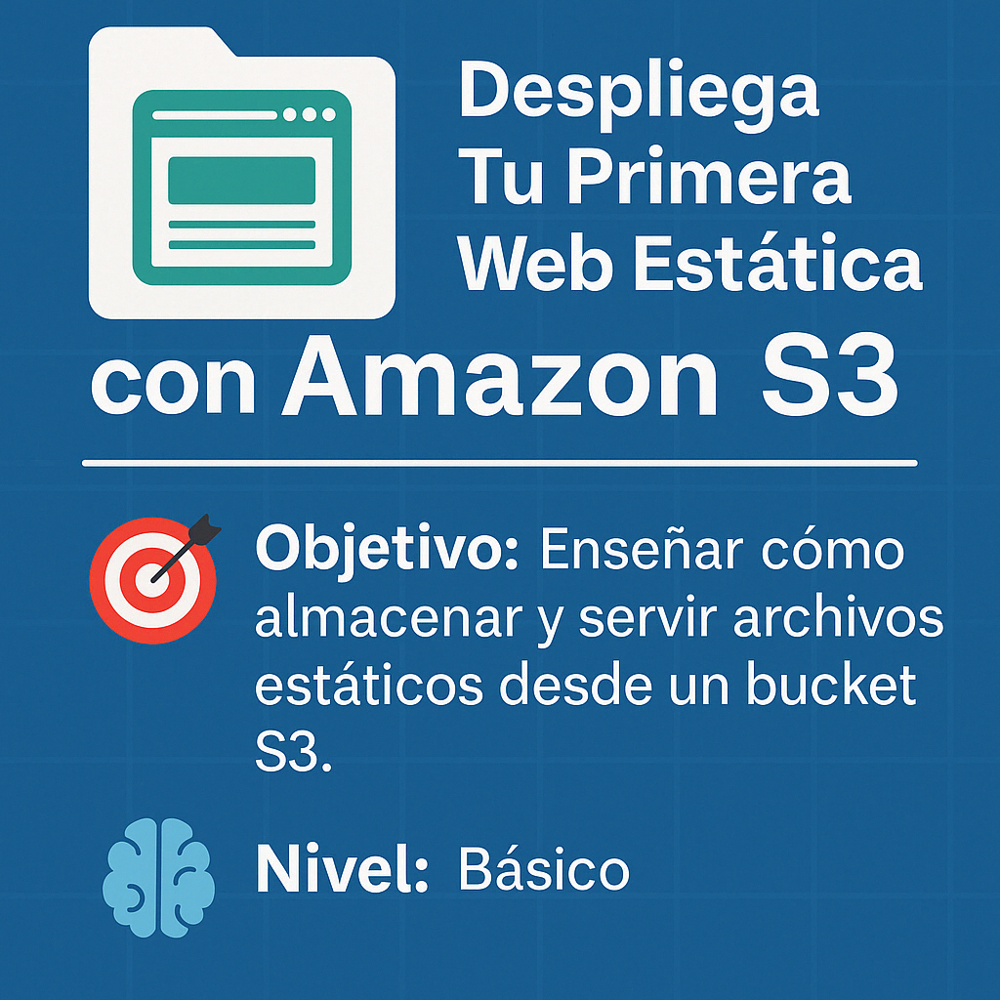

# 🧪 Lab Cloud – Despliega Tu Primera Web Estática con Amazon S3



Este laboratorio es ideal para quienes están comenzando en el mundo cloud. Aprenderás a publicar tu primera página web usando Amazon S3, sin necesidad de servidores ni configuraciones complejas. 🌐

---

## 🎯 Objetivo de Aprendizaje

Enseñar cómo **almacenar y servir archivos estáticos** (HTML, CSS, JS, imágenes, etc.) directamente desde un bucket de Amazon S3 configurado como sitio web.

🧠 **Nivel:** Básico
🔄 **Duración** 15 min

---

## 🛠️ Servicios utilizados

- 🔹 **Amazon S3**
- 🔹 **IAM (opcional para permisos personalizados)**
- 🔹 **Route 53** (opcional para dominio personalizado)

---

## 📦 ¿Qué vamos a construir?

Publicaremos un sitio estático que podría incluir una página HTML básica con imágenes o estilos, y lo haremos accesible públicamente desde Internet.

---

## 📌 Paso a paso del laboratorio

### 1️⃣ Crear el Bucket en S3

- Accede al servicio S3 desde la consola de AWS.
- Clic en **“Crear bucket”**.
- Asigna un nombre único (ejemplo: `mi-sitio-estatico-labcloud`).
- Desactiva el bloqueo de acceso público (habilitar acceso público).
- Deja las demás configuraciones por defecto y crea el bucket.

---

### 2️⃣ Habilitar el Hosting Estático

- Entra a tu bucket → pestaña **“Propiedades”**.
- Busca la sección **“Alojamiento de sitio web estático”**.
- Actívalo y define:
  - Documento de índice: `index.html`
  - Documento de error (opcional): `error.html`

Guarda los cambios.

---

### 3️⃣ Subir los Archivos del Sitio Web

- Asegúrate de tener un archivo `index.html`.
- Estructura recomendada:
  ```
  /sitio-web
  ├── index.html
  ├── estilos.css (opcional)
  └── imagenes/ (opcional)
  ```
- Carga los archivos en el bucket.

---

### 4️⃣ Hacer los Archivos Públicos

**Opción recomendada**

- Selecciona todos los archivos subidos.
- Clic en **“Permisos” → “Editar Bucket Policy”**.
- Pegar politica que de permisos públicos a los archivos
- Clic en **“Grabar cambios”**.

**Opción no recomendada**

- Selecciona los archivos subidos.
- Clic en **“Acciones” → “Hacer públicos”**.
- Confirma los permisos para que puedan ser accedidos desde cualquier navegador.

---

### 5️⃣ Probar el Sitio Web

- Vuelve a la pestaña de propiedades → sección **Alojamiento de sitio web estático**.
- Copia la URL del sitio y ábrela en tu navegador.
- ¡Tu sitio web estático ya está en línea!

---

## ⚠️ Consideraciones Importantes

- Los archivos deben incluir `index.html` como página principal.
- El bucket debe tener **acceso público** para que el sitio sea visible.
- Usa nombres de archivo simples (sin espacios ni caracteres especiales).
- Puedes agregar `error.html` para mostrar una página personalizada ante errores 404.

---

## 🧪 Recursos del laboratorio

**1. [Archivos de ejemplo HTML](./recursos/GreenBite.zip)**  
**2. [Imagen de arquitectura](./imagenes/diagrama_arquitectura.PNG)**  
**3. [Video tutorial paso a paso](https://youtu.be/VqV4rx3SY4o)**  
**4. [Script para automatizar despliegue vía AWS CLI](./recursos/Script_para_automatizar_despliegue_via_AWS_CLI.txt) (opcional)**

---

## 📢 Síguenos y únete a la comunidad

- **YouTube:** [CloudOps Guild](https://www.youtube.com/@CloudOpsGuildCommunity)  
- **Medium:** [@marioserranopineda](https://medium.com/@marioserranopineda)  
- **LinkedIn:** [Mario Serrano](https://www.linkedin.com/in/mario-rodrigo-serrano-pineda/)  
- **Blog:** [CloudOps Guild](https://cloudopsguild.com/blog/)  
- **MeetUp:** [AWS Cartagena Community](https://www.meetup.com/es-ES/aws-colombia-cartagena/)  
- **Facebook:** [AWS Cartagena Community](https://www.facebook.com/awscolombiacartagena)

---

## 📝 Licencia

Este proyecto está bajo la licencia MIT. Consulta el archivo [LICENSE](LICENSE) para más detalles.

---

🌐 ¡Felicidades por publicar tu primera web en la nube con Amazon S3!
