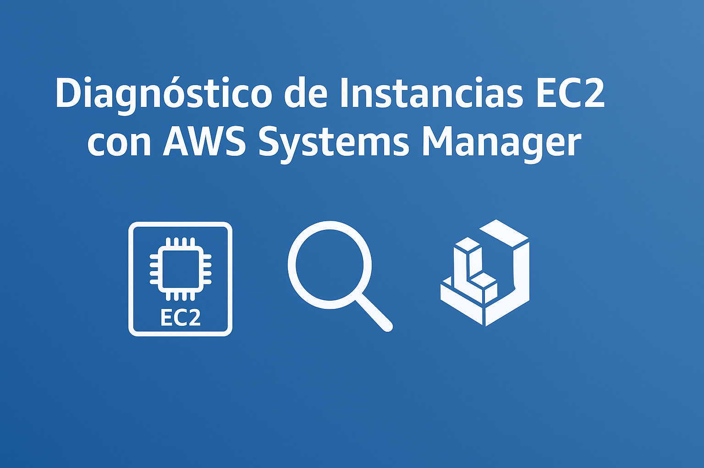

# 🩺 Diagnóstico de Instancias EC2 con AWS Systems Manager

Este laboratorio contiene el paso a paso para diagnosticar una instancia EC2 de forma segura y sin conexión SSH, utilizando AWS Systems Manager. Se emplean herramientas como \*\*Session Manager\*\*, \*\*Run Command\*\* e \*\*Inventory\*\* para revisar el estado del sistema, ejecutar comandos remotos y obtener información clave para mantenimiento.

---

\#\# 🎯 Objetivo de Aprendizaje

Al completar este laboratorio, los participantes podrán:  
\- Activar AWS Systems Manager en una cuenta.  
\- Conectarse a instancias EC2 sin usar claves SSH.  
\- Ejecutar comandos remotos desde la consola de AWS.  
\- Recopilar datos del sistema y evaluar el estado general de una instancia.  
\- Aplicar buenas prácticas de diagnóstico y mantenimiento seguro en AWS.

\---

\#\# 🛠️ Servicios Usados

\- 🔹 \*\*Amazon EC2\*\*  
\- 🔹 \*\*AWS Systems Manager (SSM)\*\*  
\- 🔹 \*\*IAM\*\*  
\- 🔹 \*\*CloudWatch (Logs de sesión y Run Command)\*\*

---

\#\# 🧩 Caso de Uso Real

\*Un equipo de operaciones necesita diagnosticar una instancia EC2 en producción que ha dejado de responder a peticiones. Por seguridad, el acceso SSH está restringido. Con AWS Systems Manager pueden conectarse directamente, revisar procesos, espacio en disco y aplicar comandos de remediación sin comprometer la seguridad ni abrir puertos en el firewall.\*

—

### **🔹 AWS Systems Manager (SSM)**

Servicio que permite administrar y automatizar tareas operativas en instancias EC2 y otros recursos de AWS, sin necesidad de conectarse vía SSH o RDP. Facilita el mantenimiento, diagnóstico, ejecución remota de comandos y aplicación de parches.

---

### **🔹 SSM Agent**

Programa que corre dentro de las instancias EC2 y permite la comunicación entre AWS Systems Manager y la instancia. Es esencial para que la instancia pueda recibir comandos y reportar su estado.

---

### **🔹 Managed Instance**

Una instancia EC2 que está registrada y visible en AWS Systems Manager. Esto significa que:

* Tiene el agente SSM instalado y corriendo.

* Tiene un rol IAM con los permisos necesarios.

* Tiene acceso a internet o a los endpoints privados de Systems Manager.

---

### **🔹 Session Manager**

Herramienta dentro de Systems Manager que permite conectarse a una instancia EC2 a través de una terminal web en la consola de AWS. No requiere abrir el puerto 22 ni usar claves SSH, lo que mejora la seguridad.

---

### **🔹 Run Command**

Funcionalidad que permite ejecutar comandos remotos en una o más instancias EC2 desde la consola de AWS, sin necesidad de conectarse manualmente. Es útil para diagnósticos, instalación de software, reinicio de servicios, etc.

---

### **🔹 Documentos SSM (SSM Documents)**

Plantillas o scripts que definen acciones que se pueden ejecutar con Systems Manager. Por ejemplo, `AWS-RunShellScript` permite ejecutar comandos tipo bash. Existen documentos administrados por AWS y personalizados por el usuario.

---

### **🔹 Inventory**

Módulo de Systems Manager que recolecta información detallada de las instancias EC2, como aplicaciones instaladas, procesos en ejecución, configuraciones de red, etc. Ayuda a tener visibilidad de la infraestructura sin necesidad de scripts personalizados.

---

### **🔹 Fleet Manager**

Consola visual que agrupa y permite administrar múltiples instancias EC2 desde un solo lugar. Desde ahí puedes ver detalles del sistema, iniciar sesiones, ver archivos, procesos, configuraciones y métricas del sistema operativo.

—-------

\#\# 🧱 Diagrama de Arquitectura del Laboratorio

\!\[diagrama\_ssm\](imagenes/ssm\_ec2\_diagnostico.png)

\---

\#\# 📌 Pasos para Configurar el Laboratorio

\---

\#\#\# 🧭 1\. Activar AWS Systems Manager

\- Ingresa a la consola de \*\*AWS Systems Manager\*\*  
\- Si es la primera vez, haz clic en \*\*"Get Started"\*\* o \*\*"Activar Systems Manager"\*\*  
\- Verifica que las opciones \*\*Fleet Manager\*\*, \*\*Session Manager\*\*, \*\*Run Command\*\* e \*\*Inventory\*\* estén disponibles

\---

\#\#\# 🖥️ 2\. Lanzar una Instancia EC2 Compatible

\- Ve a \*\*EC2 \> Launch Instance\*\*  
\- Configura:  
  \- Nombre: \`Instancia-Diagnostico-SSM\`  
  \- AMI: Amazon Linux 2  
  \- Tipo: \`t2.micro\`  
  \- Red: VPC predeterminada con salida a Internet  
  \- Grupo de seguridad: permite puerto 80 o 22 (aunque no se usará SSH)  
  \- Par de claves: opcional  
\- En "Configuraciones avanzadas", asigna un perfil de instancia con permisos:

\`\`\`plaintext  
Nombre del rol: EC2-SSM-Role  
Permisos requeridos: AmazonSSMManagedInstanceCore

---

### **🧪 3\. Verificar que la Instancia esté "Managed"**

* Ve a **Systems Manager \> Fleet Manager**

* Asegúrate de que la instancia aparece como "Managed"

* Si no aparece:

  * Verifica conectividad a internet

  * Asegura que el rol está asignado

  * Revisa que el **SSM Agent** esté en ejecución (ya viene con Amazon Linux 2\)

---

### **🛠️ 4\. Conexión sin SSH con Session Manager**

* Ir a **Session Manager \> Start session**

* Selecciona tu instancia y haz clic en **Start session**

* Ejecuta comandos como:

uptime  
df \-h  
top \-n 1  
free \-m

---

### **🛜 5\. Ejecutar un Diagnóstico Remoto con Run Command**

* Ir a **Run Command \> Run a command**

* Selecciona el documento: `AWS-RunShellScript`

* En parámetros escribe:

**`cat /var/log/cloud-init-output.log`**

tail \-n 20 /var/log/messages   ultimas 20 lineas de logs del sistema

dmesg | tail \-n 10

—------------------------

### **Desglose paso a paso**

1. **`dmesg`**:

   * Muestra el **buffer de mensajes del kernel** (registro del sistema operativo Linux relacionado con eventos del sistema, como detección de hardware, errores, arranque, etc.).

   * Es útil para diagnosticar problemas de hardware, controladores, discos, red, etc.

2. **`|` (pipe)**:

   * Redirige la **salida del comando `dmesg`** como entrada al siguiente comando.

3. **`tail -n 10`**:

   * Muestra las **últimas 10 líneas** de la entrada recibida.

**Muestra los últimos 10 mensajes del kernel** registrados por el sistema.  
 Es útil para ver rápidamente los eventos más recientes, como:

* Detección de nuevos dispositivos USB

* Problemas de red

* Errores del sistema de archivos

* Problemas de hardware

—--------------------------------------------

* Elige la instancia y ejecuta

* Verifica la salida del comando desde la consola

---

### **📊 6\. Activar Inventory para ver datos del sistema**

* Ve a **Systems Manager \> Inventory**

* Haz clic en **Setup Inventory**

* Selecciona la instancia

* Habilita recolectores como:

  * `AWS:Application`

  * `AWS:Network`

  * `AWS:InstanceInformation`

* Espera unos minutos y explora los resultados desde **Fleet Manager**

---

## **⚠️ Consideraciones Importantes**

* 🔹 No es necesario abrir el puerto 22 ni tener clave privada

* 🔹 Todos los accesos quedan registrados en CloudWatch

* 🔹 Asegura que la instancia tenga acceso a internet (NAT Gateway o IGW)

* 🔹 Si usas una AMI personalizada, asegúrate que tenga el SSM Agent activo

---

## **📎 Recursos Adicionales**

* [Session Manager – AWS Docs](https://docs.aws.amazon.com/systems-manager/latest/userguide/session-manager.html)

* [Run Command – AWS Docs](https://docs.aws.amazon.com/systems-manager/latest/userguide/run-command.html)

* [IAM Roles para EC2](https://docs.aws.amazon.com/IAM/latest/UserGuide/id_roles_use_switch-role-ec2.html)

* [Video paso a paso](https://youtu.be/mnC5K92eWsU)

---

## **✅ Red de la Comunidad CloudOps Guild**

* **YouTube:** [CloudOps Guild](https://www.youtube.com/@CloudOpsGuildCommunity)

* **Medium:** [@marioserranopineda](https://medium.com/@marioserranopineda)

* **LinkedIn:** [Mario Serrano](https://www.linkedin.com/in/mario-rodrigo-serrano-pineda/)

* **Blog CloudopsGuild:** [https://cloudopsguild.com/blog/](https://cloudopsguild.com/blog/)

* **LinkedIn CloudOpsGuild:** [CloudOps Guild](https://www.linkedin.com/company/cloudopsguild/)

* **MeetUp:** [AWS Cartagena Community](https://www.meetup.com/es-ES/aws-colombia-cartagena/)

* **Facebook:** [AWS Cartagena Community](https://www.facebook.com/groups/awscolombiacartagena)

---

## **📝 Licencia**

Este laboratorio está bajo la licencia MIT. Revisa los detalles en el archivo [LICENSE](https://chatgpt.com/g/g-p-67d067a3a54c8191ad3f63470531cc2b-challenge-aws-certified-sysops-administrator/c/LICENSE).

---
