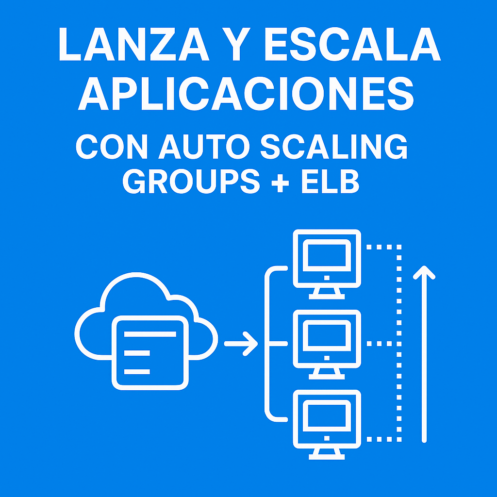
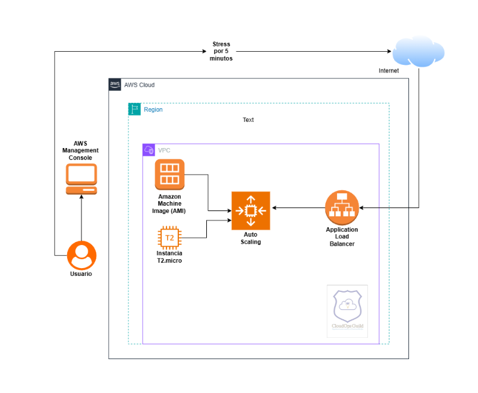

# 🧪 Lab Cloud: Lanza y Escala Aplicaciones con Auto Scaling Groups + ELB



---

🎯 **Objetivo:**  
Implementar una arquitectura en AWS que escale automáticamente instancias EC2 con un Load Balancer y un Auto Scaling Group según la demanda de tráfico.

🧠 **Nivel:** Intermedio  
⏱️ **Duración estimada:** 60–90 minutos  
💰 **Costo:** Bajo (uso del nivel gratuito con `t2.micro` o `t3.micro`)

---

## 🧩 Caso de uso real

**GreenBite**, la startup enfocada en promover recetas saludables, está lanzando su nueva campaña **"Desayunos Naturales"**. Esperan un aumento repentino de tráfico al sitio web desde distintas partes del país. Para asegurar disponibilidad y rendimiento, el equipo decide escalar su aplicación web dinámicamente usando **Auto Scaling Groups** y balanceo de carga con un **Application Load Balancer (ALB)**.

---

## 🛠️ Requisitos previos

- Cuenta activa en AWS  
- Familiaridad básica con EC2 y balanceadores de carga  
- Haber completado laboratorios previos sobre servidores web EC2

---

## 🗺️ Arquitectura del laboratorio

🔹 **Launch Template**  
Plantilla con los parámetros para lanzar instancias EC2 (AMI, tipo, user-data, etc.)

🔹 **Auto Scaling Group (ASG)**  
Grupo que lanza o termina instancias automáticamente según la demanda

🔹 **Application Load Balancer (ALB)**  
Balanceador que distribuye el tráfico entre instancias en múltiples zonas

🔹 **AMI (Amazon Machine Image)**  
Imagen personalizada con SO, configuraciones y software preinstalado



---

## 🔧 Paso a paso

### 1️⃣ Sign in to AWS Management Console

- Accede a: https://console.aws.amazon.com  
- Asegúrate de estar en la región correcta (ej. `us-east-1`)

---

### 2️⃣ Crear Security Group para el Load Balancer

- EC2 > Security Groups > `Create security group`  
- Nombre: `SG-ALB-GreenBite`  
- Reglas de entrada:
  - HTTP – Puerto 80 – Source: `0.0.0.0/0`
  - HTTPS – Puerto 443 – Source: `0.0.0.0/0` (opcional)  
- Reglas de salida: dejar por defecto

---

### 3️⃣ Crear Security Group para Launch Template

- Nombre: `SG-EC2-GreenBite`  
- Reglas de entrada:
  - SSH – Puerto 22 – Source: tu IP
  - HTTP – Puerto 80 – Source: **Security Group del ALB (referencia por ID)**  
- Reglas de salida: dejar por defecto

---

### 4️⃣ Crear una Key Pair

- Ir a EC2 > Key Pairs > `Create Key Pair`  
- Nombre: `GreenBite-Key`  
- Tipo: RSA  
- Descargar y guardar el `.pem`

---

### 5️⃣ Crear Launch Template

- EC2 > Launch Templates > `Create launch template`  
- Nombre: `LT-GreenBite-App`  
- AMI: Amazon Linux 2  
- Tipo de instancia: `t2.micro`  
- Key Pair: `GreenBite-Key`  
- Security Group: `SG-EC2-GreenBite`  
- **User Data**:

```bash
#!/bin/bash
yum update -y
yum install -y httpd stress
systemctl enable httpd
systemctl start httpd
echo "<h1>Bienvenido a GreenBite 🌱 - Instancia lista para escalar</h1>" > /var/www/html/index.html
```

### 6️⃣ Crear el Application Load Balancer (ALB)
EC2 > Load Balancers > Create Load Balancer

Tipo: Application Load Balancer

Nombre: ALB-GreenBite

Esquema: Internet-facing

Listener: HTTP puerto 80

AZs: al menos 2 subnets públicas

Security Group: SG-ALB-GreenBite

Crear Target Group:

Nombre: TG-GreenBite

Tipo: Instance

Protocolo: HTTP puerto 80

Health Check: ruta /, código 200

Asociar el Load Balancer con el Target Group

### 7️⃣ Crear el Auto Scaling Group (ASG)
EC2 > Auto Scaling Groups > Create Auto Scaling Group

Nombre: ASG-GreenBite-App

Launch Template: LT-GreenBite-App

Red: VPC + 2 subnets públicas

Load Balancer: Asociar con TG-GreenBite

Política de escalado:

Mínimo: 1

Deseado: 2

Máximo: 4

CPU > 60% → Escala OUT

CPU < 20% → Escala IN

### 8️⃣ Validar el acceso al sitio
Abre http://<DNS-DEL-ALB> en tu navegador

Deberías ver el mensaje:
“Bienvenido a GreenBite 🌱 - Instancia lista para escalar”

### 9️⃣ (Opcional) Conéctate por SSH
```bash
Copiar
Editar
ssh -i GreenBite-Key.pem ec2-user@<IP-DE-LA-INSTANCE>
```

### 🔟 Instalar stress (si no se hizo en el user-data)

```bash
Copiar
Editar
sudo yum install -y stress
```

### 1️⃣1️⃣ Simular carga
Desde la instancia conectada:

```bash
Copiar
Editar
stress --cpu 2 --timeout 300
```

O desde PowerShell en Windows:

powershell
```
Editar
1..500 | ForEach-Object { Start-Job { Invoke-WebRequest -Uri "http://<DNS-ALB>" -UseBasicParsing > $null } }
```

### 1️⃣2️⃣ Validar escalado
EC2 > Auto Scaling Groups > Monitoring

Verifica cómo el grupo escala al aumentar la CPU

Las nuevas instancias también deberían servir el sitio web

### 1️⃣3️⃣ Limpieza de recursos
✅ Para evitar costos:

Eliminar el Auto Scaling Group

Eliminar el Launch Template

Eliminar el Load Balancer y el Target Group

Eliminar los Security Groups creados

Eliminar la Key Pair si no la vas a reutilizar

---

## 📚 Recursos del laboratorio

**1. Código script servidor web para user data**  
**2. Código HTML pagina web de prueba**  
**3. Video tutorial paso a paso [Aquí](https://youtu.be/c6lNr1kXe_Y)**  
**4. Comandos ejemplos para generar carga a instancia a través de stress y curl**

---

📣 ¿Te gustó este laboratorio?
Forma parte de nuestra comunidad educativa CloudOps Guild y accede a más laboratorios, retos y recursos prácticos sobre AWS, DevOps e inteligencia artificial aplicada a la nube.

---

## 📢 Conecta con la comunidad

- **YouTube:** [CloudOps Guild](https://www.youtube.com/@CloudOpsGuildCommunity)  
- **Medium:** [@marioserranopineda](https://medium.com/@marioserranopineda)  
- **LinkedIn (autor):** [Mario Serrano](https://www.linkedin.com/in/mario-rodrigo-serrano-pineda/)  
- **Blog:** [CloudOps Guild](https://cloudopsguild.com/blog/)  
- **MeetUp:** [AWS Cartagena Community](https://www.meetup.com/es-ES/aws-colombia-cartagena/)  
- **Facebook:** [AWS Cartagena](https://www.facebook.com/awscolombiacartagena)

📄 Licencia
Este laboratorio está licenciado bajo los términos de la MIT License.

Puedes reutilizar, adaptar y compartir este contenido libremente, siempre que incluyas atribución al autor original.