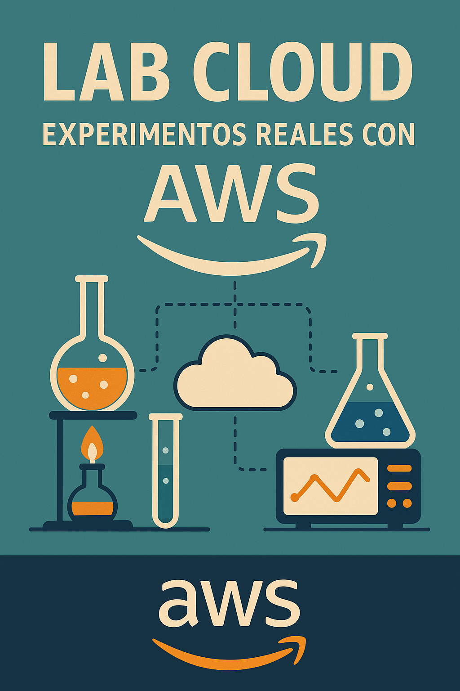

# ⚗️ Lab Cloud: Experimentos Reales con AWS

¡Bienvenido a la serie **Lab Cloud**!  

Aquí encontrarás una colección de laboratorios prácticos diseñados para aprender haciendo en el mundo de AWS. Cada experimento está enfocado en resolver un reto real usando servicios de la nube. 🌩️🧪

---

## 🎯 Propósito de la serie

Explorar los servicios de AWS de forma práctica, directa y guiada paso a paso.  
Ideal para estudiantes, profesionales y entusiastas que quieren pasar de la teoría a la acción.

---

## 🧪 Laboratorios Disponibles

### 🟢 Nivel Básico

- **Despliega Tu Primera Web Estática con Amazon S3**  
  🎯 Aprende a almacenar y servir archivos estáticos desde un bucket.  

- **Crea un Servidor Web con Amazon EC2 y Apache/Nginx**  
  🎯 Lanza una instancia, conéctate vía SSH e instala un servidor web.  

- **Protege Tu Infraestructura con Grupos de Seguridad**  
  🎯 Configura reglas para controlar tráfico entrante y saliente en EC2.  

- **Sube y Comparte Archivos con S3 + Pre-signed URLs**  
  🎯 Comparte archivos de forma segura con URLs temporales.  

- **Tu Primer Bucket S3 con Políticas de Acceso Personalizadas**  
  🎯 Restringe quién puede leer o escribir en tu bucket.  

---

### 🟡 Nivel Intermedio

- **Automatiza Tareas con AWS Lambda + EventBridge**  
  🎯 Ejecuta funciones automáticamente ante eventos programados.  

- **Accede a EC2 sin SSH usando SSM Session Manager**  
  🎯 Conéctate a instancias sin usar claves ni abrir puertos.  

- **Auto Scaling Groups + ELB**  
  🎯 Lanza y escala aplicaciones automáticamente.  

- **Almacena y Consulta Datos con Amazon DynamoDB**  
  🎯 Crea una base de datos NoSQL y aprende a interactuar con ella.  

- **Crea un API RESTful sin servidores (API Gateway + Lambda)**  
  🎯 Diseña una API completamente serverless.  

- **Centraliza Logs y Monitorea con CloudWatch**  
  🎯 Habilita métricas, logs y alarmas.  

- **Agrega Autenticación con Amazon Cognito**  
  🎯 Integra un sistema de autenticación de usuarios.  

- **Automatiza Backups con AWS Backup**  
  🎯 Configura respaldos automáticos para EC2 y otros recursos.  

---

### 🔴 Nivel Avanzado

- **Despliega Infraestructura como Código con CloudFormation**  
  🎯 Usa plantillas YAML para desplegar recursos automáticamente.  

- **Configura una Red Privada con VPC, NAT Gateway y Subredes**  
  🎯 Diseña una red aislada y segura.  

- **Orquesta Tareas Serverless con Step Functions + Lambda**  
  🎯 Crea flujos de trabajo coordinando múltiples funciones.  

---

## 🎥 Recursos Visuales y Complementarios

- 📺 **Videos paso a paso** disponibles en nuestro canal: [YouTube – CloudOps Guild](https://www.youtube.com/@CloudOpsGuildCommunity)
- ✍️ Publicaciones y artículos explicativos en: [Medium](https://medium.com/@marioserranopineda)
- 📚 Diagrama de arquitectura, scripts y códigos en cada laboratorio individual.

---

## 📢 Síguenos y únete a la comunidad

- 🧠 **LinkedIn (autor):** [Mario Serrano](https://www.linkedin.com/in/mario-rodrigo-serrano-pineda/)
- 🧑‍💻 **LinkedIn CloudOps Guild:** [CloudOps Guild](https://www.linkedin.com/company/cloudopsguild/)
- 💬 **MeetUp:** [AWS Cartagena Community](https://www.meetup.com/es-ES/aws-colombia-cartagena/)
- 📘 **Facebook:** [AWS Cartagena Community](https://www.facebook.com/awscolombiacartagena)
- 📝 **Blog Oficial:** [cloudopsguild.com/blog](https://cloudopsguild.com/blog/)

---

## 📜 Licencia

Este proyecto está bajo la licencia MIT.  
Consulta el archivo [LICENSE](LICENSE) para más detalles.

---

¡Atrévete a experimentar con la nube! ☁️🧪
