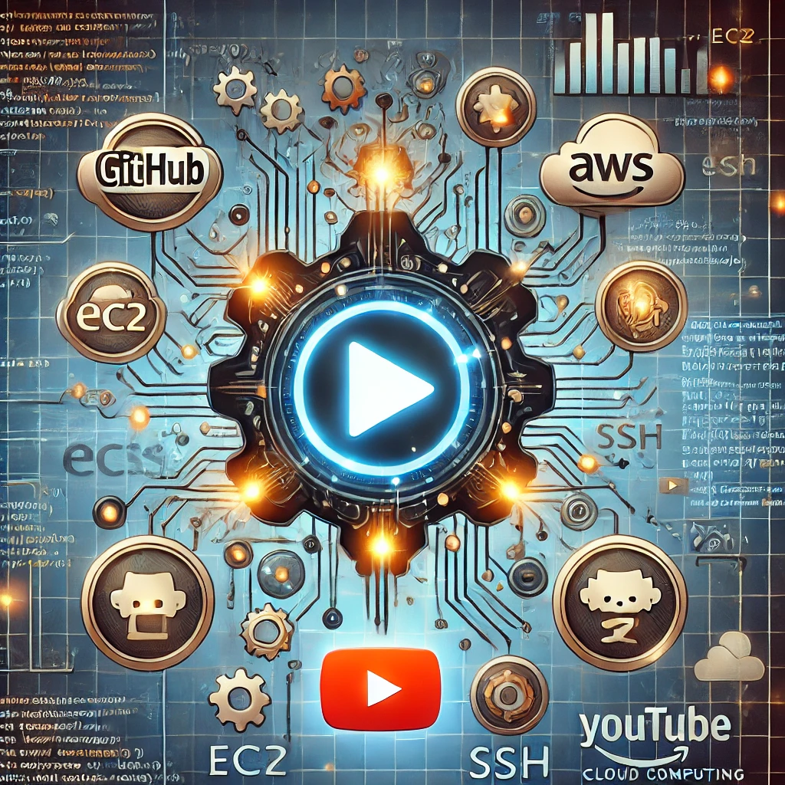

# 🎥 CloudOps Guild: Series de Videos Técnicos sobre Cloud, AWS, DevOps y SRE

## 📝 Descripción del Repositorio

Este repositorio es el hogar de todas nuestras **series de videos técnicos** donde aprenderás desde lo más básico hasta temas avanzados en **Cloud Computing, AWS, DevOps y SRE**. 🚀📡

Cada serie está diseñada para brindarte un aprendizaje estructurado y progresivo, con contenido práctico y aplicado en el mundo real. 🌍✨

---

## 🎯 Objetivo de Aprendizaje

Este repositorio te permitirá acceder a múltiples series de videos donde mejorarás tus habilidades en **Cloud Computing, Automatización, Seguridad, DevOps, SRE y más**. Aprenderás con ejemplos prácticos, laboratorios y consejos de expertos que te ayudarán a destacarte en el sector tecnológico. 💡

---

## 📌 Series de Videos Disponibles

### 🆕 1️⃣ **Domina las Conexiones SSH a EC2: De Novato a Experto** 🔐
📍 Aprende todos los métodos esenciales para conectarte a instancias EC2 en AWS, desde Instance Connect hasta configuraciones avanzadas de seguridad.  
📺 **[Accede a la serie completa](https://youtube.com/playlist?list=PLqv_IB8VVqODk_iZHqB__OZIgDCN9WCtu&si=GeR3tGvFG8sZ5d5X)**

### 🛠️ 2️⃣ **Próximas Series (¡Muy Pronto!)**
- **Introducción a AWS para Principiantes** 🌍
- **Infraestructura como Código con Terraform** 🏗️
- **Automatización con Ansible y AWS Lambda** ⚙️
- **Estrategias de Observabilidad en Cloud con Prometheus y Grafana** 📊
- **Implementación de CI/CD en AWS con Jenkins y GitHub Actions** 🔄
- **Buenas Prácticas en Arquitecturas Serverless** ☁️

---

## 🏆 ¿Por qué seguir estas series?

✅ Aprendizaje estructurado paso a paso 📈  
✅ Contenido actualizado con tecnologías de vanguardia 🚀  
✅ Videos prácticos con laboratorios reales 🛠️  
✅ Para todos los niveles: Básico, Intermedio y Avanzado 🎯  
✅ Mejora tu perfil profesional y acelera tu carrera en la nube 🌍  

¡Sigue este repositorio y no te pierdas ninguna serie! 🎥✨

---

## 📚 Recursos Adicionales

- 📖 [Documentación oficial de AWS](https://docs.aws.amazon.com/)
- 🎥 [Playlist completa en YouTube](https://www.youtube.com/@CloudOpsGuildCommunity)
- 📝 [Guía de Buenas Prácticas en DevOps y SRE](URL_BLOG)

---

## 🤝 ¡Conéctate con la comunidad!
🌟 **YouTube:** [CloudOps Guild](https://www.youtube.com/@CloudOpsGuildCommunity)  
✍️ **Medium:** [@marioserranopineda](https://medium.com/@marioserranopineda)  
💼 **LinkedIn:** [Mario Serrano](https://www.linkedin.com/in/mario-rodrigo-serrano-pineda/)  

## 📢 ¡Síguenos en nuestras redes!
📝 **Blog CloudOpsGuild:** [Blog](https://cloudopsguild.com/blog/)  
💼 **LinkedIn CloudOpsGuild:** [CloudOps Guild](https://www.linkedin.com/company/cloudopsguild/)  
📅 **MeetUp:** [Grupo MeetUp AWS Cartagena Community](https://www.meetup.com/es-ES/aws-colombia-cartagena/)  
📘 **Facebook:** [AWS Cartagena Community](https://www.facebook.com/aws.cartagena/)  

---

## 📝 **Licencia**
Este proyecto está bajo la licencia **MIT**. Puedes consultar los detalles en el archivo **LICENSE**. 📜